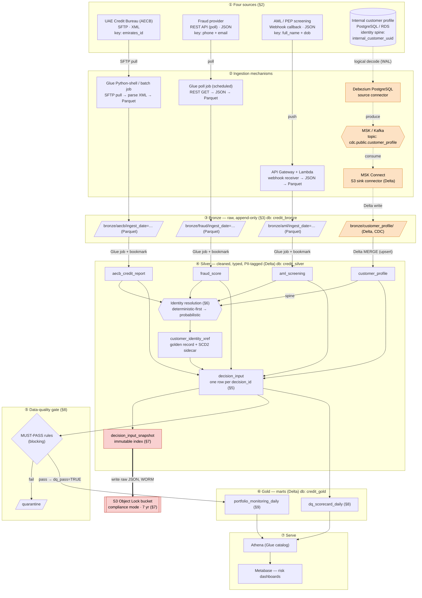
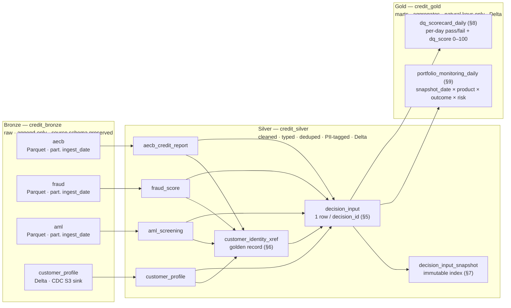
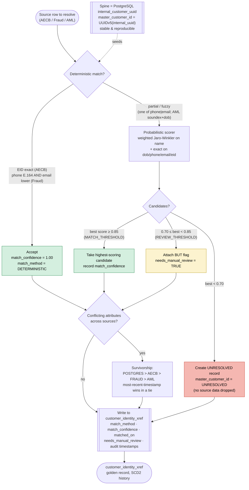
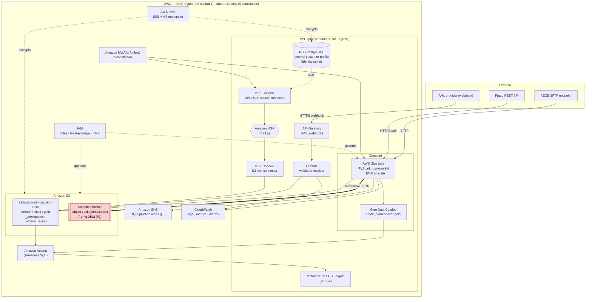
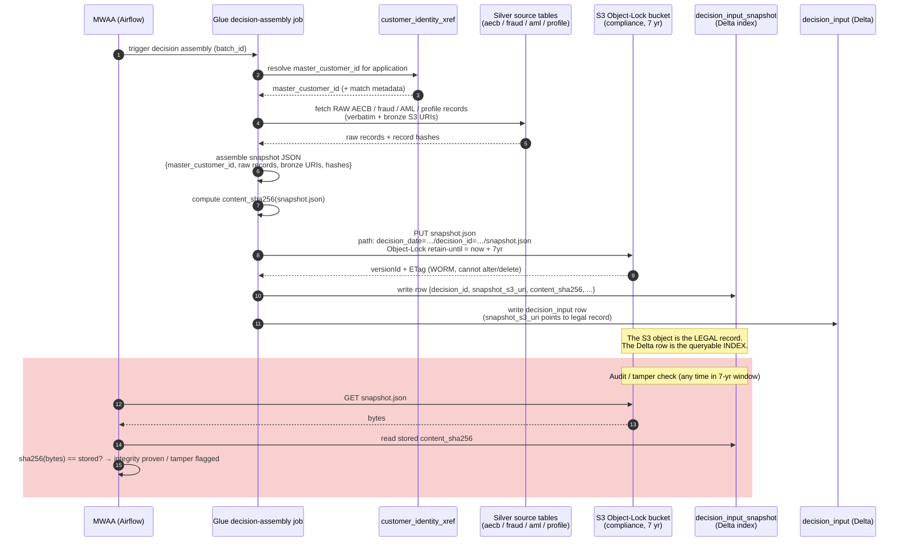

# Credit Decision Data Platform — Architecture

> **Scope of this document:** the end-to-end architecture for the UAE credit-decision data
> platform described in [`../SPEC.md`](../SPEC.md). It is the visual + narrative companion to the
> SPEC — the SPEC is the contract, this document explains how the pieces fit and why.
>
> All diagrams below are **Mermaid** and render natively on GitHub and in most Markdown viewers.
> The AWS deployment view is additionally rendered to a PNG by [`generate_diagram.py`](./generate_diagram.py)
> (see [`README.md`](./README.md) for render commands).

---

## 0. Executive summary

The platform assembles a **unified, immutable, audit-grade decision-input record** for every credit
application across three products (`PERSONAL_FINANCE`, `BNPL`, `CARD_ALT`) by fusing four independent
sources, resolving customer identity across them, freezing every input for UAE Central Bank audit,
scoring data quality, and serving a portfolio-monitoring mart to the risk team.

The design is a **medallion lakehouse on AWS** (Delta Lake on S3, Glue Data Catalog, Athena) with four
purpose-fit ingestion paths feeding a common Bronze landing zone. It launches at **10K decisions/day**
on AWS Glue and scales to **100K/day** with a documented, code-compatible migration to EMR. Every design
choice below traces back to a SPEC section, cited inline as (§n).

Key architectural properties:

| Property | How it is achieved | SPEC ref |
|---|---|---|
| Right-tool-per-source ingestion | SFTP batch, REST poll, webhook, and Debezium CDC each land in Bronze | §2 |
| Incremental, replayable processing | Glue job bookmarks (batch) + Delta MERGE (CDC/upserts) | §3 |
| One identity across four sources | Deterministic-first, probabilistic-fallback resolution → golden record | §6 |
| Regulator can reconstruct any decision | Immutable JSON snapshot under S3 Object Lock (compliance mode), 7-yr | §7 |
| No silent data loss | Unresolved records are materialised, never dropped | §6 |
| Quality gate before serving | Two-tier DQ (must-pass quarantines; warn alerts) | §8 |
| Cost/perf headroom to 100K/day | Same PySpark on Glue → EMR; partition + compaction tuning | §3 |

---

## 1. End-to-end data flow

This is the master diagram: the four sources, their distinct ingestion mechanisms, the Bronze landing,
the Bronze→Silver Glue transforms, identity resolution, the unified `decision_input` plus its immutable
snapshot, the DQ gate, the Gold marts, and serving via Athena + Metabase. The **CDC path is drawn
distinctly** (Debezium → MSK → S3 sink → Delta Bronze) from the batch / API / webhook paths.

**Reading the diagram.** Three of the four sources are pull/push *events* landed by lightweight
ingestion (a Glue batch job for SFTP, a scheduled Glue poll job for the REST API, an API Gateway +
Lambda receiver for the AML webhook). The **fourth source — PostgreSQL — is streamed** via change data
capture: Debezium reads the WAL, publishes to an MSK/Kafka topic, and an MSK Connect S3 sink lands it as
Delta in `bronze/customer_profile/`. The CDC path (orange, dotted) is deliberately different because
PostgreSQL is the **identity spine (§2, §6)** — its changes must flow continuously and be upsertable, not
batch-appended. Everything converges at Bronze, is conformed into Silver, fused through identity
resolution into `decision_input`, snapshotted immutably, quality-gated, and rolled up into the Gold marts
that Athena and Metabase serve.

---

## 2. Medallion layers (Bronze / Silver / Gold)

The table inventory below is exactly the S3 layout and Glue catalog databases in SPEC §3–§4.

**Layer contracts (from SPEC §3, §10):**

- **Bronze** — raw and append-only, source schema preserved, partitioned by `ingest_date`. Parquet for
  the batch/API/webhook sources; **Delta** for the CDC sink so it can be MERGE-upserted downstream.
- **Silver** — Delta tables registered in the Glue catalog. Cleaned, typed, deduped, and **PII-tagged**
  in Delta column `COMMENT` (`PII Level 1|2|3`: EID/passport = L1; phone/email/dob/address = L2; derived
  = L3). Every Silver table carries the audit block `source_system`, `batch_id`, `created_timestamp`,
  `updated_timestamp`.
- **Gold** — marts exposing **natural keys only** (no surrogate `_sk`, no `is_current`/`effective_*`).
  Money is always `DECIMAL(18,2)`; scores are `DECIMAL(5,4)` (0–1) or `DECIMAL(5,2)` (0–100).

---

## 3. Identity resolution flow (§6)

Identity resolution is the heart of the platform: it fuses four sources with four different native match
keys (`emirates_id`, `phone+email`, `full_name+dob`, `internal_customer_uuid`) into one golden record.
The strategy is **deterministic-first, probabilistic-fallback**, and — critically — **nothing is ever
silently dropped**.

**Rules encoded (SPEC §6, §11):**

1. **Spine seeding** — each PostgreSQL row deterministically seeds one `master_customer_id` via
   `UUIDv5(internal_customer_uuid)`, so ids are stable and reproducible across reruns.
2. **Deterministic joins** — AECB on normalised `emirates_id` (strip spaces/dashes); Fraud on normalised
   `phone` (E.164) **AND** lowercased `email`. A both-match on a strong key ⇒ `match_confidence = 1.00`,
   `match_method = DETERMINISTIC`.
3. **Probabilistic fallback** — partial Fraud matches (one of phone/email) and all AML matches
   (`soundex(full_name) + date_of_birth`, fuzzy by construction) go to the scorer (weighted Jaro-Winkler
   on name, exact on dob/phone/email/eid).
4. **Thresholds** — `MATCH_THRESHOLD = 0.85` accepts; `REVIEW_THRESHOLD = 0.70 … 0.85` attaches with
   `needs_manual_review = TRUE`; below `0.70` produces an **UNRESOLVED** record — data is preserved, never
   dropped.
5. **Survivorship** — for conflicting demographics, source priority `POSTGRES > AECB > FRAUD > AML`;
   most-recent-timestamp wins within the same priority.

Every decision is written with `match_method`, `match_confidence`, `matched_on`, `needs_manual_review`,
and full audit timestamps, so the resolution itself is auditable.

---

## 4. AWS deployment view

The physical AWS footprint. This is the view rendered to PNG by [`generate_diagram.py`](./generate_diagram.py)
(`aws_deployment.png`); the Mermaid version below is the always-available source of truth.

**Deployment notes:**

- **Networking** — all stateful services (RDS, MSK, Metabase) live in **private subnets**; only API
  Gateway is public (TLS) for the AML webhook. Egress to AECB/Fraud is via NAT.
- **Compute** — Glue runs the PySpark ingestion + transform + identity + DQ jobs at launch. The *same
  PySpark* runs on **EMR** when volume demands it (see §6 below).
- **Storage** — one data bucket (`bronze/silver/gold/_checkpoints/_athena_results`) plus a **separate
  Object-Lock bucket** in compliance mode for the 7-year immutable snapshots (§7). Both encrypted with
  **SSE-KMS**.
- **Orchestration** — **Amazon MWAA (managed Airflow)** schedules and sequences ingestion → transform →
  identity → DQ → mart jobs, and manages the CDC connectors.
- **Residency** — the entire stack is pinned to an **AWS UAE region (`me-central-1`)** to satisfy UAE
  Central Bank data-residency requirements.

---

## 5. Decision traceability — audit-snapshot sequence (§7)

For every `decision_id`, the exact bytes of all inputs are frozen so a regulator can reconstruct precisely
what the credit engine saw. This sequence shows how the immutable snapshot is produced and how tamper
detection works.

**Why this satisfies the regulator (SPEC §7):**

- The snapshot is a **single immutable JSON object** containing the resolved `master_customer_id` and the
  **verbatim raw** AECB/fraud/AML/profile records, each with its Bronze S3 URI and record hash — full
  reconstruction of "what the engine saw".
- It is written under **S3 Object Lock (compliance mode)** so neither an operator nor the root account can
  alter or delete it for **7 years** (`SNAPSHOT_RETENTION_YEARS = 7`).
- The `content_sha256` stored in the queryable Delta index makes any post-hoc tampering **detectable** —
  the Delta row is the index, the S3 object is the legal record.

---

## 6. Incremental processing, and the Glue → EMR migration path

### Incremental processing story

The platform never reprocesses history it has already handled:

- **Batch sources (AECB SFTP, Fraud REST)** use **Glue job bookmarks**. Each run resumes from the last
  committed bookmark, so only new `ingest_date` partitions / new files are read. Reruns are idempotent.
- **CDC source (PostgreSQL)** flows continuously through Debezium → MSK → S3 sink as Delta, then is applied
  to Silver with **Delta `MERGE`** (upsert on `internal_customer_uuid`) — late and out-of-order changes
  converge correctly.
- **Silver → decision_input** likewise uses **Delta `MERGE`** keyed on `decision_id`, so re-runs update in
  place rather than duplicating. The immutable snapshot is written **once** per `decision_id` (Object Lock
  refuses overwrite), guaranteeing one legal record per decision.
- **Gold marts** are rebuilt per `snapshot_date` partition (idempotent overwrite of the affected date),
  cheap because the grain is a small daily cube.

### Glue → EMR migration path

The launch runs on **AWS Glue** (serverless Spark, fast to stand up, no cluster management — ideal at
10K/day). The design keeps a clean migration door open:

- **Same code** — all transforms are plain **PySpark + Delta**, not Glue-DynamicFrame-only APIs, so the
  identical job code runs on EMR (or EMR Serverless) unchanged.
- **Bookmarks → checkpoints** — the only Glue-specific dependency is job bookmarks; on EMR the equivalent
  is a Delta/`_checkpoints` high-watermark table (already provisioned in the S3 layout, SPEC §3). The
  bookmark logic is isolated behind a small incremental-read helper so the swap is one module.
- **Catalog unchanged** — both Glue and EMR read/write the **same Glue Data Catalog** and the same S3
  Delta tables; Athena is unaffected.
- **Trigger** — migrate when per-run cost or SLA on Glue crosses the threshold (evaluated in the 61–90 day
  load test). EMR wins on sustained, large, shuffle-heavy jobs; Glue wins on spiky, small, serverless
  jobs — so a **hybrid** (keep light ingestion on Glue, move heavy identity/mart jobs to EMR) is the
  expected end state.

---

## 7. How the design meets the scale target (10K → 100K/day)

| Lever | At launch (10K/day) | At scale (100K/day) |
|---|---|---|
| Compute | Glue serverless Spark, bookmarks | EMR / EMR-Serverless for heavy jobs; Glue for light ingestion |
| Partitioning | `ingest_date` (bronze), `decision_date`/`snapshot_date` (silver/gold) | same keys; add `product_code` sub-partition on hot marts |
| File sizing | default Delta writes | scheduled `OPTIMIZE` compaction + `Z-ORDER` on `master_customer_id` / `decision_id` |
| CDC | single MSK broker set, 1 connector | scale MSK partitions + connector tasks with WAL volume |
| Identity resolution | broadcast-join spine; probabilistic on the small fuzzy tail | salt/bucket the probabilistic candidate set; cache spine |
| DQ | Soda Core + Glue DQ job per batch | same checks, parallelised per partition |
| Serving | Athena on Delta | partition projection + result reuse; pre-aggregated marts keep scans small |
| Cost | pay-per-Glue-DPU-hour | reserved EMR + S3 lifecycle to IA/Glacier for cold bronze |

Because the marts are pre-aggregated daily cubes (SPEC §9) and Athena only ever scans small Gold
partitions, **serving cost is flat as decision volume grows** — the 10× scale-up lands almost entirely on
the ingestion/transform tier, which is exactly the tier the Glue→EMR path and compaction tuning address.

---

## 8. Cross-references

| Diagram / section here | SPEC section |
|---|---|
| §1 End-to-end data flow | §2 sources, §3 S3 layout |
| §2 Medallion layers | §3 S3 layout, §4 catalog, §5, §10 |
| §3 Identity resolution | §6, §11 constants |
| §4 AWS deployment | §3, §7 (Object Lock), compliance |
| §5 Audit-snapshot sequence | §7 |
| §6 Incremental + EMR | §3 |
| `decision_input` grain/columns | §5 |
| DQ two-tier gate | §8 |
| Portfolio + DQ marts | §8, §9 |
