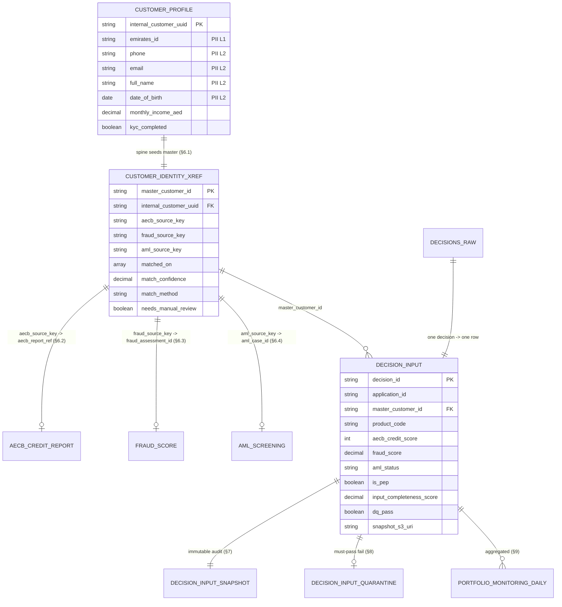
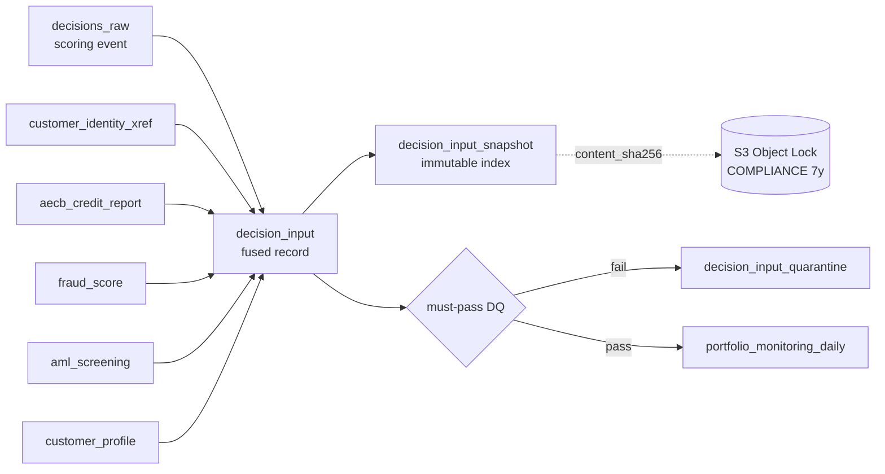

# Data Model — Credit Decision Platform

The physical/logical data model across the medallion layers. It complements
[`../SPEC.md`](../SPEC.md) (contracts) and the DDLs in [`../../athena/ddl/`](../../athena/ddl/)
(the schema of record — each silver/gold table is written and self-registered by its Glue job).

Conventions follow the Wio data-modeling standard: `snake_case`; money `DECIMAL(18,2)` (never
`FLOAT`); `*_timestamp`→`TIMESTAMP` (GST/UTC+4), `*_date`→`DATE`; `is_`/`has_` booleans; PII tagged
in column comments; silver carries the audit block `source_system, batch_id, created_timestamp,
updated_timestamp`.

---

## 1. Layer model

| Layer | Catalog DB | Format | Purpose | Incremental mechanism |
|---|---|---|---|---|
| Bronze | `credit_bronze` | Parquet (Delta for CDC sink) | Raw landing, source schema preserved, append-only | Glue bookmarks (batch/API) / Kafka Connect (CDC) |
| Silver | `credit_silver` | Delta | Cleaned, typed, deduped, PII-tagged, identity-resolved | Delta `MERGE` upsert on the natural key |
| Gold | `credit_gold` | Delta | Marts / aggregates for BI + DQ | Delta `MERGE` on the mart grain |

Bronze money/timestamps land as raw `STRING` and are typed on the way into silver. Silver/gold
enforce the typed contract.

---

## 2. Table catalog (grain + primary key)

### Bronze (`credit_bronze`)
| Table | Grain | Source (SPEC §2) |
|---|---|---|
| `aecb_raw` | one row per AECB report | AECB SFTP/XML |
| `fraud_raw` | one row per fraud event | Fraud REST/JSON |
| `aml_raw` | one row per AML screening | AML webhook/JSON |
| `customer_profile_raw` | one CDC change event | PostgreSQL Debezium CDC |
| `decisions_raw` | one row per scoring event | Decision engine (driver feed, §2.1) |

### Silver (`credit_silver`)
| Table | Grain / PK | Notes |
|---|---|---|
| `aecb_credit_report` | `aecb_report_ref` | matched on `emirates_id` (§6.2) |
| `fraud_score` | `fraud_assessment_id` | matched on `phone`+`email` (§6.3) |
| `aml_screening` | `aml_case_id` | matched on `name_soundex`+`date_of_birth` (§6.4) |
| `customer_profile` | `internal_customer_uuid` | **the identity spine** (§6.1); CDC latest-per-key |
| `customer_identity_xref` | `master_customer_id` | **the golden record** (§6) |
| `decision_input` | `decision_id` | **the unified decision record** (§5) |
| `decision_input_snapshot` | `decision_id` | immutable audit index (§7) |
| `decision_input_quarantine` | `decision_id` | must-pass DQ failures (§8) |

### Gold (`credit_gold`)
| Table | Grain | Notes |
|---|---|---|
| `portfolio_monitoring_daily` | `snapshot_date × product_code × decision_outcome_band × risk_band` | risk dashboards (§9) |
| `dq_scorecard_daily` | `scorecard_date` | DQ scorecard + `dq_score` (§8) |

---

## 3. Entity relationships (silver)

---

## 4. Identity resolution model (SPEC §6)

`customer_identity_xref` is the golden record. The PostgreSQL spine seeds one
`master_customer_id` per customer (deterministic UUIDv5 of `internal_customer_uuid`). Each of
the other three sources is linked deterministically where a strong key matches, else scored
probabilistically (weighted Jaro-Winkler on name + exact bonuses on dob/phone/email/eid):

- **≥ 0.85** → attach (`match_method = DETERMINISTIC|PROBABILISTIC`, `match_confidence`).
- **0.70–0.85** → attach but `needs_manual_review = TRUE` (stewardship queue).
- **< 0.70** → **UNRESOLVED** sentinel row — nothing is dropped.

Conflicting demographics are resolved by **survivorship** (priority `POSTGRES > AECB > FRAUD > AML`,
recency within a priority). `matched_on` records exactly which keys fired. The queryable stewardship
queue is `athena/views/v_unresolved_identities.sql`.

---

## 5. Decision lineage & audit (SPEC §5 / §7)

Every decision freezes the verbatim input bytes to an S3 Object-Lock (COMPLIANCE, 7-year) object;
`content_sha256` in `decision_input_snapshot` makes tampering detectable. The regulator lookup view is
`athena/views/v_decision_audit_trail.sql`.

---

## 6. PII classification matrix (SPEC §10 / security §4)

| Attribute | Column(s) | PII level | Where it may appear |
|---|---|---|---|
| Emirates ID | `emirates_id` | **Level 1** | bronze, silver — never in gold |
| Phone | `phone` | Level 2 | bronze, silver — masked/omitted in gold |
| Email | `email` | Level 2 | bronze, silver — omitted in gold |
| Date of birth | `date_of_birth` | Level 2 | bronze, silver — omitted in gold |
| Full name | `full_name` | Level 2 | bronze, silver — omitted in gold |
| Name soundex | `name_soundex` | Level 3 (derived) | silver |
| PEP flag | `is_pep` | Level 3 | silver, gold (aggregated exposure) |

Gold marts expose **no Level 1/2 PII** — only natural business keys (`master_customer_id`,
`decision_id`) and aggregates. Snapshots (the legal record) retain the raw PII but sit behind
Object Lock + KMS with write-only access (see `infra/terraform/iam.tf`).

---

## 7. Type quick-reference

| Concept | Type |
|---|---|
| Natural/business id | `STRING` |
| Money (`*_aed`) | `DECIMAL(18,2)` |
| Probability/score 0–1 (`*_score`) | `DECIMAL(5,4)` |
| Score 0–100 | `DECIMAL(5,2)` |
| Boolean (`is_*`/`*_completed`) | `BOOLEAN` |
| Date only (`*_date`) | `DATE` |
| Date+time (`*_timestamp`) | `TIMESTAMP` (GST) |
| Set of keys (`matched_on`) | `ARRAY<STRING>` |
